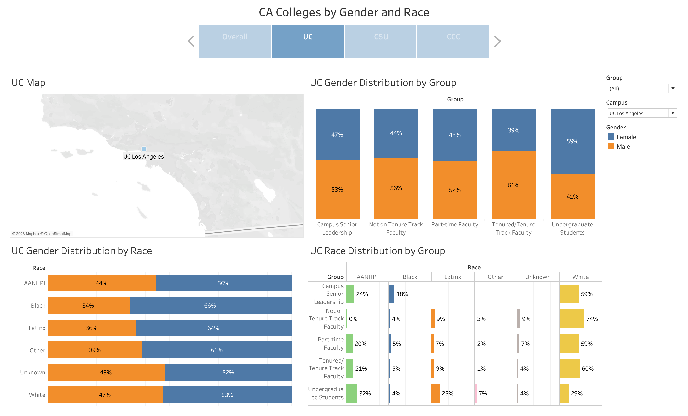

<h2 align="center">👋 Hello! I'm Tristan</h2>

I am a data science consultant primarily interested in using data analytics, data science, and machine learning to drive business insights and decisions, and have also previously been involved in researching advanced machine learning and deep learning techniques such as natural language processing (NLP) and reinforcement learning (RL).

- 🔬 My top skills are Python, R, SQL, and Tableau.
- 🌱 I’m currently learning: marketing mix modeling!
- 📫 How to reach me: **[Email](mailto:tristandewing@gmail.com), [LinkedIn](https://www.linkedin.com/in/tristan-dewing)**

## 🔧 Technologies & Tools

**Languages:**

**Packages:**

**Tools:**

<!--
## &#x1f4c8; GitHub Stats

-->
